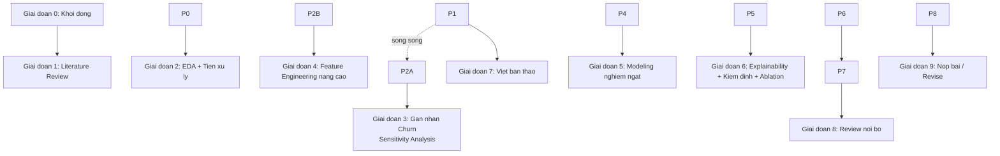

# Tổng Quan Đề Tài (Chi Tiết Nâng Cao)

## Thông tin đề tài

* **Tên đề tài**: Explainable Machine Learning for Predicting Customer Churn in E-commerce
* **Mục tiêu nghiên cứu**: Dự đoán customer có khả năng không quay lại mua hàng trong 3 hoặc 6 tháng tới hay không.
* **Bộ dữ liệu**: Online Retail II (xem `../03-du-lieu/mo-ta-du-lieu-online-retail-ii.md`).
* **Định hướng**: full-time, nghiên cứu học thuật ở mức chỉn chu nhất có thể — nhắm tới ít nhất một tạp chí/hội nghị quốc tế có phản biện (Scopus).

## Đóng khung bài toán

Non-contractual churn — dùng kỹ thuật **observation window + prediction window**: chọn cutoff date, tính đặc trưng từ dữ liệu trước cutoff, gán nhãn churn=1 nếu không mua trong 3/6 tháng sau đó, luôn kiểm tra **right-censoring** trước khi gán nhãn.

\---

## Sơ đồ phụ thuộc giữa các giai đoạn

Lưu ý: **Giai đoạn 1 (Literature Review) chạy song song** với mọi giai đoạn khác vì không phụ thuộc dữ liệu — nên bắt đầu ngay từ tuần đầu tiên và duy trì liên tục, không phải làm xong rồi mới sang giai đoạn 2.

\---

## Bảng tiến độ tổng quan

|#|Giai đoạn|Thời gian (1 người)|Trạng thái|
|-|-|-|-|
|0|Khởi động|Tuần 0|⬜ Chưa xác nhận|
|1|Literature Review|4-5 tuần (song song)|🟡 Đã có công cụ, cần điền tiếp|
|2|EDA + Tiền xử lý + Biến đổi|2-3 tuần|✅ Đã có notebook chi tiết|
|3|Gán nhãn Churn (Sensitivity Analysis)|1-2 tuần|✅ Đã có notebook|
|4|Feature Engineering nâng cao|2-3 tuần|✅ Đã có notebook|
|5|Modeling nghiêm ngặt (Nested CV)|4-5 tuần|✅ Đã có notebook (Nested CV cơ bản)|
|6|Explainability + Kiểm định + Ablation|4 tuần|🟡 Đã có khung cơ bản (SHAP, Wilcoxon)|
|7|Viết bản thảo|4 tuần|⬜ Chưa bắt đầu|
|8|Review nội bộ \& format|1 tuần|⬜ Chưa bắt đầu|
|9|Nộp bài \& revise|Ngoài kiểm soát (3-9 tháng)|⬜ Chưa bắt đầu|

Chú giải: ✅ đã có tài liệu/code sẵn sàng dùng · 🟡 đã có phần cơ bản, cần làm sâu thêm · ⬜ chưa bắt đầu.

\---

## Chi tiết từng giai đoạn (checklist)

### Giai đoạn 0 — Khởi động

* \[ ] Tạo GitHub repo \& thêm thành viên — làm theo `../04-cong-cu/to-chuc-nhom-tren-github.md` (12 bước)
* \[ ] Cài Python, thư viện, Git, Overleaf, Zotero — làm theo `../04-cong-cu/huong-dan-cai-dat-cong-cu.md`

### Giai đoạn 1 — Literature Review (chạy song song xuyên suốt)

* \[ ] Tìm kiếm \& sàng lọc theo quy trình 7 bước — `../06-tai-lieu-tham-khao/quy-trinh-literature-review.md`
* \[x] 6 bài đầu tiên đã điền mẫu vào `../06-tai-lieu-tham-khao/bang-so-sanh-literature-review.xlsx`
* \[ ] Đọc full-text và trích xuất đầy đủ cột (hiện nhiều ô còn ghi "Cần đọc full-text")
* \[ ] Bổ sung thêm 10-15 bài qua snowballing
* \[ ] Chốt Research Gap cụ thể (2 ứng viên đã xác định: kết hợp Survival Analysis + XAI, và so sánh tính ổn định giữa các phương pháp XAI)

### Giai đoạn 2 — EDA + Tiền xử lý + Biến đổi dữ liệu

* \[x] Notebook đầy đủ 16 bước đã dựng sẵn — `../05-thuc-hanh/eda-va-tien-xu-ly-du-lieu.ipynb`
* \[x] Giải thích lý do \& tham khảo từng kỹ thuật — `../05-thuc-hanh/giai-thich-ky-thuat-eda-tien-xu-ly-feature-engineering.md`
* \[ ] Chạy thực tế trên dữ liệu thật, ghi lại số liệu cụ thể (tỷ lệ hoá đơn huỷ, % missing Customer ID, ngưỡng capping đã chọn...) — cần thiết để viết Methodology → Data Description sau này

### Giai đoạn 3 — Gán nhãn Churn với Sensitivity Analysis

* \[x] Mở rộng từ 1 cutoff date sang nhiều cutoff (rolling window, mỗi 2 tháng một mốc) — `../05-thuc-hanh/nang-cao-sensitivity-feature-nested-cv.ipynb` (Phần 1)
* \[x] Kiểm tra right-censoring cho từng mốc cutoff (tự động loại mốc không đủ dữ liệu)
* \[x] Thử cả 2 định nghĩa churn (3 tháng và 6 tháng) trên từng mốc
* \[x] So sánh tỷ lệ churn giữa các mốc bằng bảng + biểu đồ — xác nhận độ ổn định
* \[ ] Diễn giải kết quả thực tế (sau khi chạy trên dữ liệu thật) vào phần Discussion

### Giai đoạn 4 — Feature Engineering nâng cao

* \[x] RFM cơ bản + AvgOrderValue + NumProducts — đã có trong `thuc-hanh-churn-prediction.ipynb`
* \[x] Độ lệch chuẩn khoảng cách giữa các lần mua (`IntervalStd`) — `nang-cao-sensitivity-feature-nested-cv.ipynb` (Phần 2)
* \[x] Xu hướng chi tiêu (`SpendingTrend`, 3 tháng gần nhất vs 3 tháng trước đó)
* \[x] Tỷ lệ đơn hàng bị huỷ (`CancelRate`, tính từ dữ liệu thô)
* \[x] Feature selection bằng Mutual Information (đo cả quan hệ phi tuyến tính, không chỉ tương quan Pearson)

### Giai đoạn 5 — Modeling nghiêm ngặt

* \[x] Baseline (Logistic Regression, Decision Tree) — đã có trong `thuc-hanh-churn-prediction.ipynb`
* \[x] Advanced (Random Forest, XGBoost) — đã có
* \[x] Nested Cross-Validation đầy đủ (outer loop đánh giá + inner loop GridSearchCV tune hyperparameter) — `nang-cao-sensitivity-feature-nested-cv.ipynb` (Phần 3)
* \[x] Chạy qua nhiều seed, báo cáo mean ± std
* \[x] So sánh RFM cơ bản vs RFM+nâng cao (bước đầu của Ablation Study)
* \[ ] Chạy nested CV trên nhiều mốc cutoff từ Giai đoạn 3 (hiện chỉ dùng 1 cutoff đại diện cho modeling chính)

### Giai đoạn 6 — Explainability + Kiểm định + Ablation

* \[x] SHAP (global + local) — đã có
* \[ ] Bổ sung LIME và Permutation Importance để so sánh tính nhất quán (đây là hướng Research Gap đã xác định ở Giai đoạn 1)
* \[x] Kiểm định Wilcoxon signed-rank — đã có khung
* \[ ] Ablation study (bỏ từng nhóm đặc trưng/kỹ thuật để đo đóng góp thực sự)

### Giai đoạn 7 — Viết bản thảo

* \[ ] Abstract, Introduction, Related Work (dùng trực tiếp từ Giai đoạn 1)
* \[ ] Methodology (dùng trực tiếp từ `giai-thich-ky-thuat-eda-tien-xu-ly-feature-engineering.md`)
* \[ ] Results, Discussion, Conclusion

### Giai đoạn 8-9 — Review nội bộ, nộp bài, revise

* \[ ] Đọc chéo, format LaTeX, kiểm tra similarity
* \[ ] Nộp bài, chờ phản biện, trả lời reviewer

\---

## Bảng liên kết file (File Map)

|Giai đoạn|File tương ứng trong project|
|-|-|
|0|`04-cong-cu/huong-dan-cai-dat-cong-cu.md`, `04-cong-cu/to-chuc-nhom-tren-github.md`|
|1|`06-tai-lieu-tham-khao/quy-trinh-literature-review.md`, `06-tai-lieu-tham-khao/bang-so-sanh-literature-review.xlsx`, `06-tai-lieu-tham-khao/bai-bao-lien-quan.md`|
|2|`05-thuc-hanh/eda-va-tien-xu-ly-du-lieu.ipynb`, `05-thuc-hanh/giai-thich-ky-thuat-eda-tien-xu-ly-feature-engineering.md`|
|3, 4, 5|`05-thuc-hanh/nang-cao-sensitivity-feature-nested-cv.ipynb`|
|6|`05-thuc-hanh/thuc-hanh-churn-prediction.ipynb` (SHAP + Wilcoxon cơ bản, cần bổ sung LIME/Permutation Importance/Ablation đầy đủ)|
|Nền tảng kiến thức|`02-ly-thuyet/nen-tang-kien-thuc-explainable-ml-churn.md`|
|Mô tả dữ liệu|`03-du-lieu/mo-ta-du-lieu-online-retail-ii.md`|

\---

### Ràng buộc tuần tự cần lưu ý

* **Modeling phải đợi Feature engineering xong** — cần schema đặc trưng thống nhất giữa 3 người trước khi train.
* **Explainability phải đợi model đã train xong** — SHAP/LIME cần model cụ thể để giải thích.
* **Viết phần Results chỉ viết được sau khi có kết quả thực nghiệm ổn định.**
* **Literature review, thu thập dữ liệu, và phần lớn viết Intro/Related Work có thể làm từ rất sớm và song song với mọi giai đoạn khác.**

## Những điểm bắt buộc thêm vì hướng tới công bố học thuật

* **Không dùng một bộ dữ liệu duy nhất** — bổ sung một bộ dữ liệu e-commerce công khai khác.
* **Nhiều lần chạy với random seed khác nhau** + báo cáo trung bình và độ lệch chuẩn.
* **Kiểm định ý nghĩa thống kê** giữa các mô hình.
* **Ablation study** — chứng minh từng thành phần thực sự đóng góp vào kết quả.
* **Reproducibility** — code public trên GitHub, ghi rõ phiên bản thư viện, seed.

