# N�n Tảng Kiến Thức: Explainable Machine Learning cho Dự �oán Customer Churn trong E-commerce

> Tài liệu tham khảo tổng hợp từ con số 0 — dùng xuyên suốt quá trình thực hiện đ� tài "Explainable Machine Learning for Predicting Customer Churn in E-commerce". Mỗi phần đ�u có ví dụ số cụ thể và link tham khảo để đào sâu thêm.

---

## Phần 1: Machine Learning — �ịnh nghĩa và Phân loại

> 🔑 **Hiểu nhanh trong 1 câu**: Máy tính tự tìm ra quy luật từ hàng nghìn ví dụ dữ liệu, thay vì con ngư�i viết sẵn từng luật "nếu... thì...".
> � **Ví dụ đ�i thư�ng**: Giống như dạy một nhân viên mới bằng cách cho xem 10.000 đơn hàng cũ kèm nhãn "khách này có quay lại mua tiếp không", thay vì đưa cho h� một cuốn sổ tay quy tắc cứng nhắc — nhân viên (mô hình) tự rút ra kinh nghiệm qua việc quan sát nhi�u ví dụ.

### 1.1 �ịnh nghĩa

**Machine Learning (ML — H�c máy)** là một nhánh của Trí tuệ nhân tạo, trong đó máy tính **tự h�c ra quy luật từ dữ liệu** thay vì được lập trình tư�ng minh từng quy tắc "nếu... thì...". �ịnh nghĩa kinh điển (Tom Mitchell, 1997): một chương trình được coi là "h�c" từ kinh nghiệm E đối với nhiệm vụ T và thước đo hiệu năng P, nếu hiệu năng của nó ở T (đo bằng P) cải thiện khi có thêm E.

Ví dụ cụ thể trong đ� tài: T = dự đoán khách hàng có churn hay không, E = 1 triệu dòng giao dịch lịch sử của Online Retail II, P = điểm ROC-AUC trên tập test. Khi bạn đưa thêm dữ liệu (E) hoặc thêm đặc trưng tốt hơn, mô hình dự đoán chính xác hơn (P tăng) — đó chính là "h�c".

### 1.2 Phân loại theo phương thức h�c (Learning Paradigm)

```mermaid
graph TD
    A[Machine Learning] --> B[Supervised Learning<br/>H�c có giám sát]
    A --> C[Unsupervised Learning<br/>H�c không giám sát]
    A --> D[Semi-supervised Learning]
    A --> E[Reinforcement Learning]
    B --> B1["Classification<br/>(vd: churn 0/1)"]
    B --> B2["Regression<br/>(vd: dự đoán CLV)"]
    C --> C1["Clustering<br/>(vd: phân khúc RFM + K-means)"]
```



| Loại | �ịnh nghĩa | Ví dụ trong đ� tài |
|---|---|---|
| **Supervised Learning** | H�c từ dữ liệu đã có nhãn sẵn — mỗi mẫu đầu vào đi kèm một câu trả l�i đúng | Dự đoán churn (nhãn: churn/không churn) — paradigm chính của đ� tài |
| **Unsupervised Learning** | H�c từ dữ liệu không nhãn, tự tìm cấu trúc ẩn | Phân khúc khách hàng bằng K-means dựa trên RFM |
| **Semi-supervised Learning** | Kết hợp một phần dữ liệu có nhãn và phần lớn không nhãn | �t dùng trong đ� tài này |
| **Reinforcement Learning** | Agent h�c qua thử-sai, nhận thưởng/phạt từ môi trư�ng | Không áp dụng trong đ� tài này |

### 1.3 Phân loại theo dạng bài toán (trong Supervised Learning)

- **Classification (Phân loại)**: đầu ra là nhãn r�i rạc. Bài toán churn của bạn là **Binary Classification** — chỉ 2 lớp (1 = churn, 0 = không churn).
- **Regression (Hồi quy)**: đầu ra là giá trị số liên tục — ví dụ dự đoán Customer Lifetime Value (CLV) bằng ti�n, không phải tr�ng tâm đ� tài nhưng liên quan (xem Phần 3.4).

� **Tìm hiểu thêm:**
- [StatQuest — A Gentle Introduction to Machine Learning](https://www.youtube.com/watch?v=Gv9_4yMHFhI) (video, 4 phút, giải thích cực kỳ trực quan)
- [StatQuest — Chỉ mục toàn bộ video theo chủ đ�](https://statquest.org/) (dùng để tra cứu bất kỳ khái niệm ML/thống kê nào khác trong tài liệu này)

---

## Phần 2: Explainable AI (XAI) — H�c máy có thể giải thích

> 🔑 **Hiểu nhanh trong 1 câu**: Không chỉ đưa ra dự đoán, mà còn giải thích được TẠI SAO mô hình dự đoán như vậy.
> � **Ví dụ đ�i thư�ng**: Giống như một bác sĩ gi�i không chỉ nói "bạn bị bệnh X" mà còn giải thích "vì chỉ số huyết áp cao và bạn có triệu chứng Y" — ngư�i bệnh (ở đây là đội marketing) mới biết nên hành động cụ thể ra sao, thay vì chỉ nhận một con số xác suất mơ hồ.

### 2.1 Tại sao XAI quan tr�ng

Khi mô hình ML ngày càng phức tạp, chúng trở thành **"hộp đen" (black-box)** — dự đoán chính xác nhưng không ai hiểu cơ chế ra quyết định. Ví dụ cụ thể: một mô hình XGBoost dự đoán khách hàng A có 85% khả năng churn. Nếu không có XAI, đội marketing chỉ biết "85%" mà không biết **nên làm gì** — g�i điện? giảm giá? gửi email? XAI trả l�i "vì Recency của A là 120 ngày (rất lâu không mua) và Frequency chỉ 1 đơn duy nhất" → từ đó biết chính xác nên nhắm vào việc kéo A quay lại mua đợt tiếp theo.

XAI ra đ�i để giải quyết các nhu cầu: **Tin cậy (Trust)**, **Trách nhiệm giải trình (Accountability)**, **Gỡ lỗi mô hình (Debugging)** — ví dụ phát hiện mô hình đang dựa vào cột "Customer ID" (một con số vô nghĩa) thay vì hành vi thực sự, và **Insight hành động được (Actionable insight)**.

### 2.2 Phân loại các phương pháp XAI

```mermaid
graph LR
    X[Phương pháp XAI] --> P1[Trục 1: Th�i điểm]
    X --> P2[Trục 2: Phạm vi áp dụng]
    X --> P3[Trục 3: Phạm vi giải thích]
    P1 --> I1[Intrinsic<br/>vd: Logistic Regression]
    P1 --> I2[Post-hoc<br/>vd: SHAP, LIME]
    P2 --> M1[Model-specific]
    P2 --> M2[Model-agnostic<br/>vd: SHAP, LIME]
    P3 --> S1[Global<br/>toàn bộ tập dữ liệu]
    P3 --> S2[Local<br/>một khách hàng cụ thể]
```



**Ví dụ cụ thể hoá 3 trục** với cùng một mô hình XGBoost dự đoán churn:
- **Intrinsic vs Post-hoc**: XGBoost tự nó không giải thích được — cần công cụ SHAP chạy *sau khi* huấn luyện xong (post-hoc). Ngược lại, nếu bạn dùng Logistic Regression, hệ số của biến Recency (ví dụ +0.8) tự nó đã là l�i giải thích (intrinsic), không cần công cụ gì thêm.
- **Model-specific vs Model-agnostic**: `feature_importances_` có sẵn trong XGBoost chỉ dùng được cho XGBoost (model-specific). SHAP thì dùng được cho cả XGBoost, Random Forest, hay thậm chí Neural Network (model-agnostic).
- **Global vs Local**: SHAP summary plot cho biết "Recency là đặc trưng quan tr�ng nhất trên toàn bộ 2000 khách hàng test" (global). SHAP force plot cho một khách hàng cụ thể cho biết "khách hàng #482 bị dự đoán churn chủ yếu vì Recency=120 ngày, dù Monetary cao cũng không đủ bù lại" (local).

### 2.3 Các phương pháp XAI cụ thể (có ví dụ số)

**SHAP (SHapley Additive exPlanations)**: dựa trên Shapley value từ lý thuyết trò chơi hợp tác (Lloyd Shapley, 1953). Ví dụ đơn giản hoá: giả sử xác suất churn trung bình toàn tập dữ liệu (base value) là 0.30. Với một khách hàng cụ thể, mô hình dự đoán xác suất churn là 0.75. SHAP phân rã chênh lệch (0.75 − 0.30 = 0.45) thành đóng góp riêng của từng đặc trưng, ví dụ:

| �ặc trưng | Giá trị của khách hàng | �óng góp SHAP |
|---|---|---|
| Recency | 120 ngày | +0.30 (đẩy xác suất churn lên) |
| Frequency | 1 Ä‘Æ¡n | +0.10 |
| Monetary | 500.000đ (cao) | −0.05 (kéo xác suất churn xuống) |
| Tổng | | +0.45 ✓ khớp với chênh lệch |

Tính chất quan tr�ng: tổng các đóng góp SHAP luôn khớp chính xác với chênh lệch dự đoán — đây là điểm SHAP ưu việt hơn nhi�u phương pháp khác.

**LIME (Local Interpretable Model-agnostic Explanations)**: xấp xỉ mô hình phức tạp bằng một **mô hình tuyến tính đơn giản** chỉ trong vùng lân cận nh� quanh điểm dữ liệu đang xét, bằng cách tạo mẫu nhiễu loạn xung quanh rồi quan sát mô hình gốc phản ứng ra sao. Nhanh hơn SHAP nhưng kém ổn định hơn — chạy lại 2 lần có thể ra kết quả hơi khác nhau.

**Permutation Feature Importance**: xáo trộn ngẫu nhiên một cột (ví dụ xáo trộn toàn bộ giá trị Recency giữa các khách hàng) rồi đo AUC giảm bao nhiêu. Nếu AUC giảm mạnh (ví dụ từ 0.85 xuống 0.65) → Recency rất quan tr�ng. Nếu AUC gần như không đổi → đặc trưng đó gần như vô dụng.

**Partial Dependence Plot (PDP) và Individual Conditional Expectation (ICE)**: PDP vẽ đư�ng cong "nếu Recency tăng dần từ 0 đến 200 ngày, xác suất churn trung bình thay đổi ra sao" — thư�ng thấy dạng đư�ng cong tăng dần rồi bão hoà.

**Counterfactual Explanations**: trả l�i "cần thay đổi gì tối thiểu để đổi kết quả" — ví dụ: "nếu khách hàng này mua thêm 1 đơn trong 30 ngày tới, xác suất churn giảm từ 75% xuống 40%".

**Anchors**: tìm luật tối thiểu như "NẾU Recency > 90 ngày VÀ Frequency = 1 THÌ dự đoán churn đúng 95% trư�ng hợp tương tự".

� **Tìm hiểu thêm:**
- [SHAP — Tài liệu chính thức](https://shap.readthedocs.io/)
- [SHAP — Mã nguồn & ví dụ trên GitHub](https://github.com/shap/shap)
- [LIME — Mã nguồn & giải thích trực quan trên GitHub](https://github.com/marcotcr/lime)

---

## Phần 3: Customer Churn Prediction — Khái niệm h�c thuật

> 🔑 **Hiểu nhanh trong 1 câu**: �oán trước khách hàng nào sắp "biến mất" để có thể giữ chân h� TRƯỚC KHI quá muộn, thay vì chỉ biết sau khi h� đã r�i đi.
> � **Ví dụ đ�i thư�ng**: Giống như nhận ra một ngư�i bạn dạo này nhắn tin thưa dần, ít rủ đi chơi hơn — nếu để ý sớm (Recency tăng dần), bạn còn kịp chủ động liên lạc lại; nếu đợi đến lúc h� "im lặng hẳn" mới nhận ra thì đã quá muộn để giữ mối quan hệ.

### 3.1 �ịnh nghĩa churn (có ví dụ số)

**Churn (Customer Attrition)** là hiện tượng khách hàng chấm dứt quan hệ giao dịch với doanh nghiệp. Công thức đơn giản nhất: nếu đầu tháng có 1000 khách hàng, và 50 khách trong số đó r�i b� trong tháng, thì **churn rate = 50/1000 = 5%**.

### 3.2 Phân loại: Contractual vs Non-contractual churn

- **Contractual churn**: có hợp đồng/thuê bao rõ ràng (viễn thông, SaaS) — ngày huỷ được ghi nhận chính xác trong hệ thống.
- **Non-contractual churn**: như e-commerce — khách hàng không "tuyên bố" r�i b�, h� chỉ đơn giản ngừng mua. �ây là loại churn của đ� tài bạn, đòi h�i **tự định nghĩa churn bằng ngưỡng th�i gian im lặng**.

### 3.3 Timeline gán nhãn churn (minh hoạ trực quan)

```mermaid
graph LR
    A["Quá khứ<br/>(observation window)"] -->|Tính RFM, features| B["Cutoff date<br/>vd: 01/06/2011"]
    B -->|"3 hoặc 6 tháng tiếp theo<br/>(prediction window)"| C{Khách có mua<br/>hàng không?}
    C -->|Có mua| D["Nhãn = 0<br/>(không churn)"]
    C -->|Không mua| E["Nhãn = 1<br/>(churn)"]
```



Ví dụ cụ thể: cutoff = 01/06/2011, churn window = 90 ngày (3 tháng) → hạn cuối là 30/08/2011. Nếu dữ liệu của bạn chỉ có đến 15/07/2011 thì **không đủ dữ liệu** để biết chắc khách có quay lại hay không trong 90 ngày đó — đây chính là vấn đ� **right-censoring** cần kiểm tra trước khi gán nhãn.

### 3.4 Các cách tiếp cận mô hình hóa churn

| Cách tiếp cận | Bản chất | Câu h�i trả l�i |
|---|---|---|
| **Classification-based** | Phân loại nhị phân tại một mốc cutoff cố định | "Khách hàng X có churn trong 3 tháng tới không?" (cách tiếp cận chính của đ� tài) |
| **Survival Analysis** | Mô hình hóa **th�i gian đến sự kiện**, xử lý được dữ liệu **censored** | "Khách hàng X còn bao lâu nữa thì churn?" — dùng **Kaplan-Meier estimator** hoặc **Cox Proportional Hazards Model** |
| **Clustering-based** | Phân nhóm khách hàng theo hành vi (RFM + K-means) | "Khách hàng X thuộc phân khúc rủi ro nào?" |

Ví dụ trực giác v� Kaplan-Meier: tưởng tượng bạn theo dõi 10 khách hàng, mỗi tháng ghi nhận có bao nhiêu ngư�i "còn sống" (chưa churn). �ư�ng cong Kaplan-Meier vẽ tỷ lệ này giảm dần theo th�i gian dạng bậc thang — nếu đư�ng cong giảm nhanh nghĩa là khách hàng r�i b� nhanh.

### 3.5 Customer Lifetime Value (CLV) và RFM Framework

**CLV** là giá trị (lợi nhuận) mà một khách hàng đem lại trong suốt vòng đ�i quan hệ. Doanh nghiệp thư�ng ưu tiên retention cho nhóm **vừa nguy cơ churn cao, vừa CLV cao**.

**RFM Framework** — ví dụ bảng cụ thể với 3 khách hàng:

| Customer ID | Recency (ngày) | Frequency (số đơn) | Monetary (VN�) | Nhận định |
|---|---|---|---|---|
| A | 5 | 20 | 15.000.000 | Khách VIP, rủi ro churn thấp |
| B | 150 | 2 | 300.000 | Rủi ro churn rất cao |
| C | 30 | 8 | 5.000.000 | Khách ổn định, cần theo dõi |

� **Tìm hiểu thêm:**
- [Wikipedia — Churn rate (định nghĩa, công thức, ứng dụng)](https://en.wikipedia.org/wiki/Churn_rate)
- [GeeksforGeeks — Kaplan-Meier Estimator giải thích từng bước kèm code Python](https://www.geeksforgeeks.org/data-science/kaplan-meier-estimator-survival-analysis/)
- [Optimove — Hướng dẫn đầy đủ v� RFM Segmentation](https://www.optimove.com/resources/learning-center/rfm-segmentation)

---

## Phần 4: Các h� thuật toán Machine Learning (phân loại theo nguyên lý)

> 🔑 **Hiểu nhanh trong 1 câu**: Có nhi�u "cách suy luận" khác nhau để đi từ dữ liệu đến dự đoán — không có cách nào luôn luôn tốt nhất, mỗi cách có điểm mạnh/yếu riêng.
> � **Ví dụ đ�i thư�ng**: Giống như có nhi�u kiểu bác sĩ chẩn đoán bệnh — một ngư�i áp dụng một quy tắc rõ ràng duy nhất (Decision Tree: "nếu sốt trên 39 độ thì..."), một ngư�i triệu tập 300 đồng nghiệp cho ý kiến rồi lấy biểu quyết đa số (Random Forest), một ngư�i dựa vào việc so sánh với các ca bệnh tương tự từng gặp (KNN).

### 4.1 Linear Models — Logistic Regression

M´ hình hóa xác suất churn bằng hàm sigmoid áp lên tổ hợp tuyến tính của đặc trÆ°ng. Ví dụ cụ thể: giả sá»­ mô hình há»�c được công thức `z = 0.02 × Recency − 0.15 × Frequency − 0.0001 × Monetary`. Vá»›i khách hàng B ở trên (Recency=150, Frequency=2, Monetary=300.000): `z = 0.02×150 − 0.15×2 − 0.0001×300000 = 3 − 0.3 − 30 = -27.3` → qua hàm sigmoid ra xác suất gần 0 hoặc gần 1 tùy hệ số thá»±c tế đã há»�c được. Hệ số dÆ°Æ¡ng/âm cho biết ngay chiá»�u ảnh hưởng — đây là lý do mô hình này **intrinsic interpretable**.

### 4.2 Tree-based Models — Decision Tree

Xây cấu trúc cây gồm các nút "nếu đặc trưng > ngưỡng thì rẽ nhánh". Ví dụ luật cây đơn giản h�c được từ dữ liệu:
```
NẾU Recency > 90 ngày:
    NẾU Frequency <= 2:  → Dự đoán: CHURN (xác suất 82%)
    NGƯỢC LẠI:           → Dự đoán: KHÔNG CHURN (xác suất 65%)
NGƯỢC LẠI:
    → Dự đoán: KHÔNG CHURN (xác suất 90%)
```
Tiêu chí ch�n điểm chia dựa trên **Gini impurity** hoặc **Information Gain**. Dễ giải thích khi cây nông, dễ overfitting khi cây quá sâu.

### 4.3 Ensemble Methods — H�c kết hợp

- **Bagging**: huấn luyện nhi�u cây độc lập trên các tập con dữ liệu lấy mẫu ngẫu nhiên có hoàn lại (bootstrap), rồi lấy trung bình/biểu quyết. **Random Forest** — ví dụ 300 cây, mỗi cây "vote" churn hay không, kết quả cuối là tỷ lệ phiếu (vd 210/300 cây vote churn → xác suất 70%).
- **Boosting**: huấn luyện tuần tự, mỗi mô hình sau sửa lỗi (residual) của mô hình trước. **XGBoost/LightGBM** — thư�ng đạt độ chính xác cao nhất trong các mô hình cổ điển.

### 4.4 Instance-based Learning — K-Nearest Neighbors (KNN)

"Lazy learning" — khi dự đoán một khách hàng mới, tìm K khách hàng huấn luyện **gần nhất** (theo khoảng cách Euclidean giữa các vector RFM) và lấy biểu quyết đa số. Ví dụ K=5: tìm 5 khách hàng có RFM gần giống khách hàng mới nhất, nếu 4/5 ngư�i đó đã churn → dự đoán khách mới cũng churn.

### 4.5 Probabilistic Models — Naive Bayes

Dựa trên định lý Bayes, giả định các đặc trưng độc lập có đi�u kiện khi biết nhãn. Giả định "ngây thơ" này hiếm khi đúng hoàn toàn nhưng vẫn hoạt động tốt khi dữ liệu ít.

### 4.6 Kernel-based Methods — Support Vector Machine (SVM)

Tìm siêu phẳng phân chia hai lớp sao cho **l� (margin)** lớn nhất. Với dữ liệu không phân chia tuyến tính được, dùng **kernel trick** ánh xạ sang không gian nhi�u chi�u hơn.

### 4.7 Neural Networks — ANN và các biến thể chuỗi th�i gian

**ANN** mô ph�ng cấu trúc nơ-ron sinh h�c qua nhi�u lớp kết nối, tr�ng số h�c qua backpropagation (xem chi tiết ở Phần 13). Với dữ liệu chuỗi th�i gian (chuỗi giao dịch theo th�i gian của một khách hàng), **LSTM/GRU** phù hợp hơn để nắm bắt hành vi biến đổi theo th�i gian thay vì chỉ dùng RFM tĩnh.

� **Tìm hiểu thêm:**
- [scikit-learn — Decision Trees User Guide](https://scikit-learn.org/stable/modules/tree.html)
- [scikit-learn — Tài liệu LogisticRegression đầy đủ tham số](https://scikit-learn.org/stable/modules/generated/sklearn.linear_model.LogisticRegression.html)
- [3Blue1Brown — But what is a neural network? (video, cực kỳ trực quan)](https://www.youtube.com/watch?v=aircAruvnKk)

---

## Phần 5: Feature Engineering chi tiết

> 🔑 **Hiểu nhanh trong 1 câu**: Biến dữ liệu giao dịch thô (từng dòng mua hàng) thành các "chỉ số tổng hợp" có ý nghĩa mà mô hình h�c được, thay vì đưa dữ liệu thô vào thẳng.
> � **Ví dụ đ�i thư�ng**: Giống như đầu bếp không ném nguyên con cá lên bàn ăn — phải sơ chế (làm sạch, thái lát, ướp gia vị) trước. Feature Engineering chính là bước "sơ chế" dữ liệu: từ hàng nghìn dòng giao dịch của một khách hàng, "cô đặc" lại thành vài con số như Recency, Frequency, Monetary dễ tiêu hoá hơn cho mô hình.
> 📌 **Xem thêm thực hành chi tiết**: `../05-thuc-hanh/giai-thich-ky-thuat-eda-tien-xu-ly-feature-engineering.md` áp dụng các kỹ thuật dưới đây trực tiếp lên Online Retail II, kèm code và lý do cụ thể.

### 5.1 Mở rộng RFM (ví dụ số)

Ngoài R-F-M gốc, có thể tính thêm: độ lệch chuẩn khoảng cách giữa các lần mua (ví dụ khách A mua đ�u đặn mỗi 10±2 ngày → độ lệch chuẩn nh� = hành vi ổn định; khách B mua lúc thì cách 5 ngày lúc thì cách 100 ngày → độ lệch chuẩn lớn = hành vi thất thư�ng, rủi ro cao hơn), xu hướng chi tiêu (so sánh chi tiêu 3 tháng gần nhất với 3 tháng trước đó — nếu giảm liên tục là tín hiệu cảnh báo sớm), tỷ lệ đơn hàng bị huỷ/trả lại, số danh mục sản phẩm khác nhau đã mua (đo mức độ đa dạng hành vi).

### 5.2 Encoding biến phân loại (ví dụ cụ thể)

Với cột Country có giá trị "United Kingdom", "France", "Germany":
- **One-Hot Encoding**: tạo 3 cột nhị phân `Country_UK`, `Country_France`, `Country_Germany` (giá trị 0/1).
- **Label Encoding**: gán UK=0, France=1, Germany=2 — chỉ nên dùng khi có thứ tự tự nhiên (không phù hợp cho Country vì không có thứ tự).
- **Target Encoding**: thay Country bằng tỷ lệ churn trung bình của quốc gia đó (ví dụ UK có churn rate trung bình 15%, thay toàn bộ dòng UK bằng 0.15) — cần cẩn thận tránh rò rỉ dữ liệu (data leakage) khi tính tỷ lệ này chỉ trên tập train.

### 5.3 Feature Selection

- **Filter methods**: tương quan Pearson, Mutual Information, Chi-square test — ch�n dựa trên thống kê độc lập với mô hình.
- **Wrapper methods**: Recursive Feature Elimination — thử nghiệm tổ hợp đặc trưng bằng cách huấn luyện mô hình thật nhi�u lần.
- **Embedded methods**: regularization L1/Lasso, feature importance của tree-based models — tích hợp ngay trong lúc huấn luyện.

� **Tìm hiểu thêm:**
- [Mailchimp — RFM Analysis: Definition, Purpose, and Examples](https://mailchimp.com/resources/rfm-analysis/)
- [pandas — Tài liệu chính thức DataFrame.groupby (dùng để tính RFM)](https://pandas.pydata.org/docs/reference/api/pandas.DataFrame.groupby.html)

---

## Phần 6: EDA (Exploratory Data Analysis) chi tiết

> 🔑 **Hiểu nhanh trong 1 câu**: "Nhìn" và "cảm nhận" dữ liệu bằng biểu đồ và số liệu thống kê TRƯỚC KHI làm bất cứ đi�u gì với nó — không nhảy thẳng vào xây mô hình.
> � **Ví dụ đ�i thư�ng**: Giống như một thám tử quan sát kỹ hiện trư�ng (dấu vân tay, đồ vật bị xáo trộn) trước khi đưa ra kết luận, thay vì đoán mò ngay từ đầu. B� qua EDA giống như một bác sĩ kê đơn mà chưa khám bệnh.
> 📌 **Xem thực hành đầy đủ (10 bước, có biểu đồ thật)**: `../05-thuc-hanh/eda-va-tien-xu-ly-du-lieu.ipynb`

### 6.1 Phân tích đơn biến (Univariate)

Ví dụ cụ thể: vẽ histogram của Monetary trên toàn bộ khách hàng — thư�ng thấy phân phối lệch phải mạnh (right-skewed): đa số khách hàng chi tiêu thấp (dưới 1 triệu), nhưng một số ít khách bán buôn chi tiêu cực lớn (trên 50 triệu) kéo dài đuôi phân phối. Boxplot giúp nhìn ngay outlier: các điểm nằm ngoài "râu" (whisker) của boxplot.

### 6.2 Phân tích song biến (Bivariate)

Ví dụ: so sánh phân phối Recency giữa nhóm churn và không churn bằng 2 boxplot cạnh nhau — nếu nhóm churn có Recency trung vị 95 ngày còn nhóm không churn chỉ 12 ngày, đây là tín hiệu Recency rất mạnh để phân biệt hai nhóm.

### 6.3 Phân tích đa biến (Multivariate)

Ma trận tương quan (correlation heatmap): ví dụ nếu Frequency và Monetary có hệ số tương quan 0.85 (rất cao) — đây là dấu hiệu **đa cộng tuyến (multicollinearity)**, có thể cần loại bớt một trong hai hoặc kết hợp thành một đặc trưng (AvgOrderValue = Monetary/Frequency).

### 6.4 Kiểm định thống kê trong EDA

Dùng t-test để kiểm tra: "Recency trung bình của nhóm churn (95 ngày) có thực sự khác biệt có ý nghĩa thống kê so với nhóm không churn (12 ngày), hay chỉ là ngẫu nhiên?" — nếu p-value < 0.05 thì khác biệt này đáng tin cậy (xem thêm Phần 11.3 v� p-value).

� **Tìm hiểu thêm:**
- [seaborn — Tài liệu chính thức (histplot, boxplot, heatmap...)](https://seaborn.pydata.org/)
- [Real Python — Hướng dẫn pandas GroupBy chi tiết](https://realpython.com/pandas-groupby/)

---

## Phần 7: Data Preprocessing

> 🔑 **Hiểu nhanh trong 1 câu**: D�n dẹp "rác" trong dữ liệu (thiếu, sai, trùng, lệch quá mức) trước khi đưa vào mô hình — "rác vào thì rác ra" (garbage in, garbage out).
> � **Ví dụ đ�i thư�ng**: Giống như rửa và nhặt sạn gạo trước khi nấu cơm — dù nồi cơm điện (mô hình ML) có xịn đến đâu, gạo còn lẫn sạn (dữ liệu bẩn) thì cơm vẫn không ngon được.
> 📌 **Xem thực hành đầy đủ (pipeline làm sạch + capping outlier)**: `../05-thuc-hanh/eda-va-tien-xu-ly-du-lieu.ipynb` (Phần B) và lý do chi tiết ở `../05-thuc-hanh/giai-thich-ky-thuat-eda-tien-xu-ly-feature-engineering.md`

### 7.1 Xử lý dữ liệu thiếu (Missing Data)

Phân biệt: **MCAR** (Missing Completely At Random — thiếu hoàn toàn ngẫu nhiên), **MAR** (Missing At Random — thiếu có liên quan đến biến khác đã biết), **MNAR** (Missing Not At Random — thiếu liên quan đến chính giá trị bị thiếu). Với CustomerID thiếu trong Online Retail II (không rõ nguyên nhân, không suy luận được), phổ biến là loại b� kh�i phân tích theo khách hàng.

### 7.2 Xử lý giá trị ngoại lai (Outlier)

Ví dụ: một dòng có Quantity = 80.995 (đơn bán buôn cực lớn có thật) khác với Quantity = -9999 (rõ ràng là lỗi nhập liệu hoặc mã đi�u chỉnh kế toán). Cần phân biệt outlier "thật" (giữ lại) và outlier "lỗi" (loại b�).

### 7.3 Xử lý mất cân bằng lớp (Class Imbalance)

Ví dụ cụ thể: nếu trong 5000 khách hàng chỉ có 800 ngư�i churn (16%) và 4200 không churn (84%) — mô hình có thể "lư�i biếng" dự đoán tất cả là "không churn" và vẫn đạt Accuracy 84%, nhưng vô dụng vì không bắt được ai churn cả. Giải pháp:
- **SMOTE**: tạo thêm mẫu tổng hợp cho lớp thiểu số bằng nội suy giữa các điểm gần nhau.
- **Class weighting**: gán tr�ng số cao hơn cho lớp churn trong hàm mất mát (ví dụ `class_weight='balanced'` trong scikit-learn tự động tính tr�ng số nghịch đảo theo tỷ lệ lớp).
- **Undersampling**: giảm bớt mẫu lớp đa số (ví dụ chỉ lấy ngẫu nhiên 800 trong 4200 khách không churn để cân bằng với 800 khách churn).

� **Tìm hiểu thêm:**
- [scikit-learn — User Guide đầy đủ (bao gồm preprocessing, imbalanced data)](https://scikit-learn.org/stable/user_guide.html)

---

## Phần 8: Model Evaluation (�ánh giá mô hình)

> 🔑 **Hiểu nhanh trong 1 câu**: Chấm điểm xem mô hình dự đoán tốt đến đâu — nhưng "tốt" phải đo đúng cách, vì có nhi�u kiểu "tốt" khác nhau tùy vào cái gì quan tr�ng hơn với bài toán.
> � **Ví dụ đ�i thư�ng**: Giống như chấm một bài thi — không chỉ đếm "đúng bao nhiêu câu trên tổng số" (Accuracy), mà còn phải xem thí sinh đúng nhi�u ở câu dễ hay câu khó, có b� sót câu quan tr�ng nào không (Recall) — hai h�c sinh cùng đúng 85% câu h�i nhưng một ngư�i b� sót toàn câu khó thì đáng lo hơn nhi�u.
> 📌 **Xem thực hành đầy đủ (Nested CV, nhi�u seed)**: `../05-thuc-hanh/nang-cao-sensitivity-feature-nested-cv.ipynb` (Phần 3)

### 8.1 Confusion Matrix — ví dụ số cụ thể

Giả sử trên 1000 khách hàng test, trong đó 200 ngư�i thực sự churn:

| | Dự đoán: Churn | Dự đoán: Không churn |
|---|---|---|
| **Thực tế: Churn** (200 ngư�i) | 150 (True Positive) | 50 (False Negative) |
| **Thực tế: Không churn** (800 ngư�i) | 100 (False Positive) | 700 (True Negative) |

Từ bảng này: **Precision** = 150/(150+100) = **60%**, **Recall** = 150/(150+50) = **75%**, **Accuracy** = (150+700)/1000 = **85%**. Chú ý: dù Accuracy trông "cao" (85%), Precision chỉ 60% nghĩa là gần 40% khách hàng bạn nhắm retention thực ra không h� có ý định r�i b� — đây là lý do không nên chỉ nhìn Accuracy.

### 8.2 Các chỉ số đánh giá

| Chỉ số | Công thức | � nghĩa với ví dụ trên |
|---|---|---|
| **Accuracy** | (TP+TN)/Tổng | 85% — dễ gây hiểu lầm khi mất cân bằng lớp |
| **Precision** | TP/(TP+FP) | 60% — trong số dự đoán churn, 60% đúng |
| **Recall** | TP/(TP+FN) | 75% — bắt được 75% khách thực sự churn |
| **F1-score** | Trung bình đi�u hòa Precision & Recall | 2×(0.6×0.75)/(0.6+0.75) ≈ **67%** |
| **ROC-AUC** | Diện tích dưới đư�ng cong ROC | �o khả năng phân biệt tổng thể ở m�i ngưỡng, không chỉ ngưỡng 0.5 |
| **PR-AUC** | Diện tích dưới đư�ng cong Precision-Recall | Phù hợp hơn ROC-AUC khi lớp churn hiếm (như ví dụ 16% ở trên) |
| **Precision@Top-K%** | Precision khi chỉ xét K% xác suất churn cao nhất | Gắn với thực tế: ngân sách retention có hạn, chỉ nhắm 10-20% rủi ro cao nhất |

### 8.3 Cross-validation và Nested Cross-validation

**K-fold Cross-validation** (ví dụ K=5): chia 1000 khách hàng thành 5 phần bằng nhau (200 ngư�i/phần), luân phiên dùng 4 phần (800 ngư�i) để train và 1 phần (200 ngư�i) để test, lặp lại 5 lần rồi lấy trung bình kết quả — đáng tin cậy hơn nhi�u so với chỉ chia 1 lần.

**Nested Cross-validation**: dùng vòng lặp ngoài để đánh giá hiệu năng thật, vòng lặp trong (chỉ trên phần train của vòng ngoài) để tìm hyperparameter tối ưu — tránh rò rỉ thông tin từ tập test vào quá trình ch�n mô hình.

### 8.4 Kiểm định ý nghĩa thống kê

Ví dụ: chạy Random Forest và XGBoost mỗi loại 10 lần (10 seed khác nhau), thu được AUC trung bình: Random Forest = 0.82 ± 0.02, XGBoost = 0.85 ± 0.015. Dùng **Wilcoxon signed-rank test** trên 10 cặp AUC để kiểm tra: XGBoost có thực sự tốt hơn có ý nghĩa thống kê, hay chênh lệch 0.03 chỉ là ngẫu nhiên? Nếu p-value < 0.05 → khác biệt đáng tin cậy.

� **Tìm hiểu thêm:**
- [StatQuest — Machine Learning Fundamentals: The Confusion Matrix](https://www.youtube.com/watch?v=Kdsp6soqA7o)
- [StatQuest — ROC and AUC, Clearly Explained!](https://www.youtube.com/watch?v=4jRBRDbJemM)

---

## Phần 9: Phương pháp luận nghiên cứu khoa h�c (Research Methodology)

> 🔑 **Hiểu nhanh trong 1 câu**: �ặt ra "luật chơi" rõ ràng TRƯỚC KHI bắt đầu nghiên cứu (giả thuyết gì, đo bằng cách nào), để kết quả cuối cùng đáng tin cậy và ngư�i khác kiểm chứng lại được.
> � **Ví dụ đ�i thư�ng**: Giống như trước khi thi đấu thể thao, tr�ng tài công bố rõ luật chơi và cách tính điểm trước khi trận đấu bắt đầu — không thể vừa đá bóng vừa đổi luật giữa chừng cho có lợi cho một đội.

### 9.1 Research Paradigm

�� tài này thuộc **quantitative research**, theo triết lý **positivism** — tin rằng có thể đo lư�ng khách quan hiện tượng churn qua dữ liệu và kiểm định giả thuyết bằng thống kê.

### 9.2 Research Design

**Experimental/computational research** — thiết kế thực nghiệm có kiểm soát (so sánh nhi�u mô hình trên cùng dữ liệu, cùng quy trình đánh giá) để rút ra kết luận tổng quát hóa được.

### 9.3 Hình thành giả thuyết nghiên cứu (ví dụ cụ thể)

- **H1**: "Mô hình XGBoost kết hợp đặc trưng RFM mở rộng đạt ROC-AUC cao hơn có ý nghĩa thống kê (p<0.05) so với Logistic Regression baseline."
- **H2**: "Recency là đặc trưng có đóng góp SHAP trung bình (tính theo giá trị tuyệt đối) lớn nhất trong việc dự đoán churn 3 tháng."

Phát biểu giả thuyết rõ ràng như trên giúp định hướng thiết kế thực nghiệm và phần kiểm định thống kê ở Phần 8.4.

### 9.4 Reproducibility (Khả năng tái lặp)

Công bố code, ghi rõ phiên bản thư viện (`requirements.txt`) và random seed — để ngư�i khác chạy lại và kiểm chứng kết quả, ngày càng được các venue uy tín yêu cầu.

� **Tìm hiểu thêm:**
- [StatQuest — P-values, clearly explained (n�n tảng cho việc kiểm định giả thuyết)](https://statquest.org/statquest-p-values-clearly-explained/)

---

## Phần 10: Cấu trúc bài báo khoa h�c (IMRAD) chi tiết

> 🔑 **Hiểu nhanh trong 1 câu**: Một khuôn mẫu chuẩn để viết bài báo khoa h�c mà bất kỳ ai trong lĩnh vực cũng quen thuộc — giúp ngư�i đ�c tìm đúng thông tin h� cần mà không phải đ�c lan man.
> � **Ví dụ đ�i thư�ng**: Giống như m�i công thức nấu ăn đ�u có cấu trúc quen thuộc: Nguyên liệu → Cách làm → Thành phẩm — dù món ăn khác nhau, ai đ�c cũng biết ngay chỗ nào tìm nguyên liệu, chỗ nào tìm các bước thực hiện.

```mermaid
graph TD
    A[Abstract] --> B[Introduction<br/>Bối cảnh + Research gap]
    B --> C[Related Work<br/>So sánh phê phán các nghiên cứu trước]
    C --> D[Methodology<br/>Dữ liệu, features, mô hình, đánh giá]
    D --> E[Results<br/>Bảng số liệu, biểu đồ]
    E --> F[Discussion<br/>� nghĩa, hạn chế]
    F --> G[Conclusion]
    G --> H{Submission}
    H -->|Reject| I[Ch�n venue khác]
    H -->|Major/Minor Revision| J[Response letter + sửa bản thảo]
    J --> H
    H -->|Accept| K[Xuất bản]
```



1. **Abstract**: tóm tắt cô đ�ng (150-250 từ) — bối cảnh, phương pháp, kết quả chính.
2. **Introduction**: bối cảnh, tầm quan tr�ng, research gap, đóng góp (contributions, thư�ng liệt kê rõ 2-3 gạch đầu dòng).
3. **Related Work**: tổng hợp có phê phán, chỉ ra khác biệt với bài của bạn (không chỉ liệt kê).
4. **Methodology**: đủ chi tiết để tái lặp — nguồn dữ liệu, làm sạch, định nghĩa churn, đặc trưng, mô hình, đánh giá.
5. **Results**: bảng/biểu đồ, so sánh có kiểm định thống kê.
6. **Discussion**: ý nghĩa nghiệp vụ, liên hệ insight từ XAI, thừa nhận hạn chế trung thực.
7. **Conclusion**: tóm tắt đóng góp, hướng phát triển tương lai.
8. **References**: đúng chuẩn venue (IEEE, APA, Elsevier...).

� **Tìm hiểu thêm:**
- [George Mason University Writing Center — Writing an IMRaD Report](https://writingcenter.gmu.edu/writing-resources/imrad/writing-an-imrad-report)

---

## Phần 11: Toán h�c & Thống kê n�n tảng

> 🔑 **Hiểu nhanh trong 1 câu**: �ây là "ngôn ngữ" ẩn phía sau m�i thuật toán ML — không cần gi�i toán hàn lâm, nhưng cần hiểu trực giác để không dùng công cụ như một "hộp đen" mù quáng.
> � **Ví dụ đ�i thư�ng**: Giống như lái xe không cần hiểu hết cơ khí động cơ, nhưng biết đạp ga thì xe tăng tốc, đạp phanh thì xe chậm lại — hiểu đủ để lái an toàn và biết khi nào xe có vấn đ� bất thư�ng.

### 11.1 �ại số tuyến tính (Linear Algebra) cơ bản

Dữ liệu ML biểu diễn dưới dạng **ma trận** (mỗi hàng = một khách hàng, mỗi cột = một đặc trưng) và **vector**. Logistic Regression v� bản chất tính `z = X · w` (nhân ma trận dữ liệu X với vector tr�ng số w), trước khi đưa qua hàm sigmoid.

### 11.2 Giải tích cơ bản & Gradient Descent (ví dụ số từng bước)

Giả sử ta có 1 tham số w và loss function đơn giản `Loss(w) = (w - 5)²` (giá trị tối ưu thực sự là w=5, nhưng máy không biết trước). Gradient Descent bắt đầu đoán ngẫu nhiên w=0:

| Bước | w hiện tại | �ạo hàm (2×(w−5)) | w mới = w − learning_rate×đạo_hàm (learning_rate=0.1) |
|---|---|---|---|
| 1 | 0 | −10 | 0 − 0.1×(−10) = 1.0 |
| 2 | 1.0 | −8 | 1.0 − 0.1×(−8) = 1.8 |
| 3 | 1.8 | −6.4 | 1.8 − 0.1×(−6.4) = 2.44 |
| ... | ... | ... | dần tiến v� 5.0 |

�ây chính là cách hầu hết mô hình ML "h�c" — lặp đi lặp lại đi�u chỉnh nh� theo hướng ngược gradient cho đến khi hội tụ.

### 11.3 Xác suất & Thống kê

- **p-value**: xác suất quan sát được kết quả cực đoan như đã thấy (hoặc hơn) *nếu giả thuyết H0 đúng*. Ví dụ: nếu bạn kiểm định "Recency của nhóm churn khác nhóm không churn" và p-value = 0.002, nghĩa là chỉ có 0.2% khả năng chênh lệch này xảy ra do ngẫu nhiên nếu thực ra không có khác biệt gì — rất đáng tin để kết luận có khác biệt thật.
- **Khoảng tin cậy 95%**: nếu ROC-AUC trung bình qua 10 lần chạy là 0.85 với khoảng tin cậy 95% là [0.82, 0.88], nghĩa là bạn tin tưởng 95% rằng AUC thực sự nằm trong khoảng đó, không chỉ báo một con số 0.85 đơn lẻ có thể gây hiểu lầm v� độ chắc chắn.
- **Lỗi loại I/II**: Lỗi loại I = kết luận "XGBoost tốt hơn Random Forest" trong khi thực ra chúng ngang nhau (báo động giả). Lỗi loại II = kết luận "không có khác biệt" trong khi thực ra XGBoost tốt hơn thật (b� lỡ phát hiện thật).

� **Tìm hiểu thêm:**
- [3Blue1Brown — Essence of Linear Algebra (playlist đầy đủ, trực quan bằng hình ảnh)](https://www.youtube.com/playlist?list=PLZHQObOWTQDPD3MizzM2xVFitgF8hE_ab)
- [StatQuest — Stochastic Gradient Descent, Clearly Explained](https://statquest.org/stochastic-gradient-descent-clearly-explained/)

---

## Phần 12: Python & Công cụ lập trình thực hành

> 🔑 **Hiểu nhanh trong 1 câu**: �ây là bộ "đồ ngh� tay chân" biến toàn bộ lý thuyết ở các phần trên thành kết quả chạy được thật, trên dữ liệu thật.
> � **Ví dụ đ�i thư�ng**: Giống như biết công thức nấu ăn (lý thuyết ML) là chưa đủ — còn cần biết cách cầm dao, dùng bếp, đ�c công tắc lò nướng (Python, pandas, Git) thì mới thực sự nấu ra được món ăn.
> 📌 **Xem cài đặt môi trư�ng từng bước**: `../04-cong-cu/huong-dan-cai-dat-cong-cu.md`

### 12.1 Cú pháp Python cơ bản cần nắm

Kiểu dữ liệu (int, float, str, bool, list, dict, tuple, set), cấu trúc đi�u khiển (`if/elif/else`, `for`/`while`), hàm (`def`... `return`), list comprehension (viết g�n để tạo danh sách mới trong một dòng), import thư viện (`import pandas as pd`).

### 12.2 Thao tác pandas cốt lõi (ví dụ cụ thể đã dùng trong notebook thực hành)

```python
# groupby + agg để tính RFM — ví dụ thực tế đã dùng
rfm = obs_df.groupby('Customer ID').agg(
    Recency=('InvoiceDate', lambda x: (cutoff_date - x.max()).days),
    Frequency=('Invoice', 'nunique'),
    Monetary=('Revenue', 'sum'),
)
```
Dòng code trên nhóm toàn bộ giao dịch theo từng khách hàng, rồi tính 3 chỉ số RFM cùng lúc — đây chính là "phép màu" của `groupby`: biến hàng triệu dòng giao dịch thành một dòng tổng hợp cho mỗi khách hàng.

### 12.3 Trực quan hóa dữ liệu

**matplotlib** — n�n tảng, linh hoạt nhưng cú pháp dài dòng. **seaborn** — xây trên matplotlib, cú pháp g�n hơn, có sẵn heatmap tương quan, boxplot phát hiện outlier — rất phù hợp cho EDA (xem Phần 6).

### 12.4 Quản lý môi trư�ng lập trình

**Virtual environment** (venv/conda) cô lập thư viện riêng cho từng dự án. **requirements.txt** ghi lại đúng phiên bản thư viện — ví dụ `pandas==2.1.4`, `scikit-learn==1.4.0` — giúp đồng đội hoặc reviewer cài lại đúng môi trư�ng (liên hệ Phần 9.4 v� reproducibility).

### 12.5 Git cơ bản

`git init`, `git add`, `git commit -m "..."`, `git push`, `git pull` — các lệnh n�n tảng. **Branch** cho phép 3 thành viên làm việc song song mà không đè code lên nhau — ví dụ nhánh `feature/data-cleaning`, `feature/modeling`, `feature/writing`, sau đó **merge** lại vào nhánh `main` sau khi review chéo.

� **Tìm hiểu thêm:**
- [Learn Git Branching — công cụ tương tác trực quan, h�c Git ngay trên trình duyệt](https://learngitbranching.js.org/)
- [pandas — Tài liệu chính thức DataFrame.groupby](https://pandas.pydata.org/docs/reference/api/pandas.DataFrame.groupby.html)

---

## Phần 13: Deep Learning cơ bản (mở rộng phần Neural Network)

> 🔑 **Hiểu nhanh trong 1 câu**: Mạng nơ-ron là nhi�u lớp "công thức toán đơn giản" xếp chồng lên nhau, mỗi lớp h�c một mức độ trừu tượng cao hơn lớp trước.
> � **Ví dụ đ�i thư�ng**: Giống như dây chuy�n sản xuất — lớp đầu tiên chỉ nhận diện các nét đơn giản (giống công nhân đầu chỉ lắp ốc vít), lớp giữa ghép các nét đó thành hình dạng phức tạp hơn, lớp cuối mới đưa ra sản phẩm hoàn chỉnh (dự đoán cuối cùng).

### 13.1 Từ nơ-ron đến mạng (ví dụ số đơn giản)

M»™t nÆ¡-ron nhân tạo tính: `output = activation(w1×x1 + w2×x2 + ... + bias)`. Ví dụ vá»›i 2 đặc trÆ°ng đầu vào x1=Recency(chuẩn hóa)=0.8, x2=Frequency(chuẩn hóa)=0.2, trá»�ng số w1=0.6, w2=-0.3, bias=0.1: `z = 0.6×0.8 + (-0.3)×0.2 + 0.1 = 0.48 - 0.06 + 0.1 = 0.52` → qua hàm activation Sigmoid: `output ≈ 0.627`.

### 13.2 Activation Function, Loss Function

**Activation Function**: Sigmoid (đưa v� khoảng 0-1, phù hợp bài toán churn nhị phân), ReLU (phổ biến ở lớp ẩn), Tanh. **Loss Function** cho bài toán churn: **Binary Cross-Entropy** — phạt nặng khi mô hình tự tin sai (ví dụ dự đoán 0.95 xác suất không churn nhưng khách lại churn thật, loss sẽ rất lớn).

### 13.3 Backpropagation, Epoch, Batch size

**Backpropagation**: tính gradient của loss theo từng tr�ng số bằng quy tắc chuỗi (chain rule), rồi cập nhật bằng Gradient Descent (xem Phần 11.2 — cùng một nguyên lý, chỉ áp dụng cho hàng nghìn tr�ng số cùng lúc thay vì 1 tham số). **Epoch**: một lượt duyệt hết toàn bộ dữ liệu huấn luyện. **Batch size**: ví dụ batch_size=32 nghĩa là cập nhật tr�ng số sau mỗi 32 khách hàng thay vì đợi hết toàn bộ dữ liệu.

### 13.4 Regularization và RNN/LSTM/GRU

**Dropout**: ngẫu nhiên "tắt" một số nơ-ron mỗi lần huấn luyện (ví dụ tắt 20% nơ-ron ngẫu nhiên) để mạng không phụ thuộc quá mức vào vài nơ-ron cụ thể — chống overfitting. **LSTM/GRU** có cơ chế "cổng" quyết định giữ/quên thông tin qua các bước th�i gian, giải quyết vấn đ� **vanishing gradient** của RNN thông thư�ng — phù hợp khi mô hình hóa chuỗi giao dịch theo th�i gian của một khách hàng thay vì chỉ dùng RFM tĩnh.

� **Tìm hiểu thêm:**
- [3Blue1Brown — But what is a neural network? (Deep Learning chapter 1)](https://www.youtube.com/watch?v=aircAruvnKk)
- [3Blue1Brown — Essence of Linear Algebra (n�n tảng toán cho neural network)](https://www.youtube.com/playlist?list=PLZHQObOWTQDPD3MizzM2xVFitgF8hE_ab)

---

## Phần 14: �ạo đức & Trách nhiệm trong AI (Responsible AI)

> 🔑 **Hiểu nhanh trong 1 câu**: Một mô hình dự đoán gi�i thôi chưa đủ — nó còn phải công bằng, tôn tr�ng quy�n riêng tư, và không vô tình gây hại cho một nhóm khách hàng nào đó.
> � **Ví dụ đ�i thư�ng**: Giống như một nhân viên chăm sóc khách hàng gi�i không chỉ cần "nói đúng" mà còn phải cư xử công bằng với m�i khách hàng, không phân biệt đối xử dù vô tình hay cố ý.

### 14.1 Fairness (ví dụ cụ thể)

Kiểm tra: mô hình có dự đoán churn chính xác **đồng đ�u** giữa khách hàng UK và khách hàng các quốc gia khác không? Nếu AUC trên nhóm UK là 0.85 nhưng trên nhóm quốc gia khác (ít dữ liệu hơn) chỉ 0.65 — đây là dấu hiệu mô hình thiên vị do dữ liệu UK chiếm đa số, cần nêu rõ trong phần Limitations.

### 14.2 Privacy

Dữ liệu khách hàng (Customer ID, hành vi mua sắm) là dữ liệu nhạy cảm — cần ẩn danh hóa trước khi công bố dữ liệu/code kèm bài báo (ví dụ thay Customer ID thật bằng mã số ngẫu nhiên không thể truy ngược).

### 14.3 Bias

M´ hình có thể há»�c lại thiên kiến sẵn có trong dữ liệu lịch sá»­ — ví dụ nếu trÆ°á»›c đây Ä‘á»™i chăm sóc khách hàng ít quan tâm nhóm khách chi tiêu thấp, nhóm này có thể "trông giống" churn nhiá»�u hÆ¡n trong dữ liệu chỉ vì thiếu chăm sóc, không phải vì há»� thá»±c sá»± có ý định rá»�i bá»�.

� **Tìm hiểu thêm:**
- [Google for Developers — Introduction to Responsible AI](https://developers.google.com/machine-learning/guides/intro-responsible-ai)
- [Google for Developers — AI and ML ethics and safety (fairness trong dữ liệu huấn luyện)](https://developers.google.com/machine-learning/managing-ml-projects/ethics)

---

## Phần 15: Kỹ thuật viết h�c thuật bổ sung

> 🔑 **Hiểu nhanh trong 1 câu**: Viết đúng "luật chơi" h�c thuật (trích dẫn đúng, không đạo văn, viết Abstract đúng cấu trúc) để bài được cộng đồng khoa h�c tin tưởng và chấp nhận.
> � **Ví dụ đ�i thư�ng**: Giống như viết một bài luận ở trư�ng — dù ý tưởng hay đến đâu, nếu trích dẫn sai nguồn hoặc chép nguyên văn không ghi rõ, bài vẫn bị đánh giá thấp hoặc bị coi là gian lận.

- **Citation styles**: APA (khoa h�c xã hội), IEEE (khoa h�c máy tính/kỹ thuật — nhi�u khả năng venue bạn nhắm tới dùng chuẩn này), Elsevier/Harvard style.
- **Plagiarism & Paraphrasing**: đạo văn bao gồm cả việc diễn giải quá sát câu chữ gốc mà không trích dẫn — luôn ghi rõ nguồn dù đã viết lại bằng l�i của mình.
- **Cách viết Abstract hiệu quả** — ví dụ cấu trúc 4 câu cho đ� tài này: *(1)* "Dự đoán churn trong e-commerce gặp khó khăn vì thiếu tín hiệu huỷ rõ ràng như trong mô hình thuê bao." *(2)* "Nghiên cứu này áp dụng XGBoost kết hợp SHAP trên bộ dữ liệu Online Retail II để dự đoán churn 3 và 6 tháng." *(3)* "Kết quả đạt ROC-AUC 0.85, với Recency là yếu tố dự báo mạnh nhất." *(4)* "Phát hiện này gợi ý chiến lược retention nên ưu tiên khách hàng có Recency cao nhưng Monetary còn tốt."
- **Response letter khi phản biện**: trả l�i từng điểm reviewer bằng bảng đối chiếu "� kiến reviewer — Phản hồi của nhóm — Vị trí đã sửa trong bản thảo mới".

� **Tìm hiểu thêm:**
- [George Mason University Writing Center — Writing an IMRaD Report (cũng hữu ích cho phần viết Abstract)](https://writingcenter.gmu.edu/writing-resources/imrad/writing-an-imrad-report)

---

## Phần 16: Bảng thuật ngữ tổng hợp (Glossary)

| Thuật ngữ | �ịnh nghĩa ngắn g�n |
|---|---|
| Churn | Khách hàng ngừng giao dịch với doanh nghiệp |
| Non-contractual churn | Churn không có tín hiệu huỷ rõ ràng, phải tự định nghĩa bằng ngưỡng th�i gian |
| RFM | Recency, Frequency, Monetary — 3 chỉ số hành vi khách hàng cốt lõi |
| Black-box model | Mô hình phức tạp, khó hiểu cơ chế ra quyết định |
| XAI | Explainable AI — các phương pháp giải thích mô hình |
| SHAP | Phương pháp giải thích dựa trên Shapley value từ lý thuyết trò chơi |
| LIME | Phương pháp giải thích cục bộ bằng mô hình xấp xỉ tuyến tính |
| Data leakage | Rò rỉ thông tin tương lai/tập test vào quá trình huấn luyện |
| Overfitting | Mô hình h�c quá khớp với dữ liệu huấn luyện, hoạt động kém trên dữ liệu mới |
| Class imbalance | Số lượng mẫu giữa các lớp chênh lệch lớn |
| Cross-validation | Kỹ thuật chia dữ liệu nhi�u lần để đánh giá mô hình ổn định hơn |
| Ablation study | Thử loại b� từng thành phần để đo đóng góp thực sự của nó |
| Reproducibility | Khả năng ngư�i khác chạy lại và kiểm chứng được kết quả nghiên cứu |
| Gradient Descent | Thuật toán tối ưu lặp để tìm bộ tr�ng số làm hàm mất mát nh� nhất |
| p-value | Xác suất quan sát được kết quả cực đoan như vậy nếu giả thuyết H0 đúng |
| Backpropagation | Thuật toán lan truy�n ngược sai số để cập nhật tr�ng số trong mạng nơ-ron |
| Virtual environment | Môi trư�ng Python cô lập riêng cho từng dự án |
| Fairness (AI) | �ảm bảo mô hình không phân biệt đối xử bất công giữa các nhóm đối tượng khác nhau |
| Right-censoring | Trư�ng hợp không đủ dữ liệu tương lai để biết chắc một khách hàng có churn hay không |
| Kaplan-Meier estimator | Phương pháp phi tham số ước lượng xác suất "còn sống" (chưa churn) theo th�i gian |

---

*Tài liệu này tổng hợp toàn bộ khái niệm n�n tảng cần thiết cho đ� tài, kèm ví dụ số cụ thể và link tham khảo dưới mỗi phần. Khuyến nghị đ�c song song với notebook thực hành `thuc-hanh-churn-prediction.ipynb` — lý thuyết sẽ dễ nhớ hơn nhi�u khi áp dụng trực tiếp lên dữ liệu Online Retail II.*
