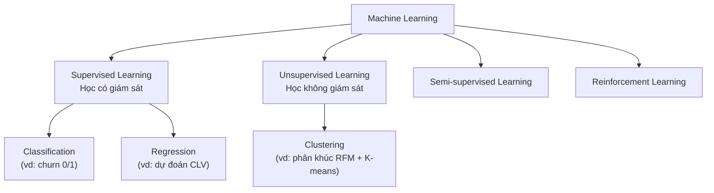

> 📚 [Mục lục](README.md) · [Phần 02: Explainable AI (XAI)](phan-02-explainable-ai.md) →

## Phần 1: Machine Learning — Định nghĩa và Phân loại

> 🔑 **Hiểu nhanh trong 1 câu**: Máy tính tự tìm ra quy luật từ hàng nghìn ví dụ dữ liệu, thay vì con người viết sẵn từng luật "nếu... thì...".
> 🌍 **Ví dụ đời thường**: Giống như dạy một nhân viên mới bằng cách cho xem 10.000 đơn hàng cũ kèm nhãn "khách này có quay lại mua tiếp không", thay vì đưa cho họ một cuốn sổ tay quy tắc cứng nhắc — nhân viên (mô hình) tự rút ra kinh nghiệm qua việc quan sát nhiều ví dụ.

### 1.1 Định nghĩa

**Machine Learning (ML — Học máy)** là một nhánh của Trí tuệ nhân tạo, trong đó máy tính **tự học ra quy luật từ dữ liệu** thay vì được lập trình tường minh từng quy tắc "nếu... thì...". Định nghĩa kinh điển (Tom Mitchell, 1997): một chương trình được coi là "học" từ kinh nghiệm E đối với nhiệm vụ T và thước đo hiệu năng P, nếu hiệu năng của nó ở T (đo bằng P) cải thiện khi có thêm E.

Ví dụ cụ thể trong đề tài: T = dự đoán khách hàng có churn hay không, E = 1 triệu dòng giao dịch lịch sử của Online Retail II, P = điểm ROC-AUC trên tập test. Khi bạn đưa thêm dữ liệu (E) hoặc thêm đặc trưng tốt hơn, mô hình dự đoán chính xác hơn (P tăng) — đó chính là "học".

### 1.2 Phân loại theo phương thức học (Learning Paradigm)

| Loại | Định nghĩa | Ví dụ trong đề tài |
|---|---|---|
| **Supervised Learning** | Học từ dữ liệu đã có nhãn sẵn — mỗi mẫu đầu vào đi kèm một câu trả lời đúng | Dự đoán churn (nhãn: churn/không churn) — paradigm chính của đề tài |
| **Unsupervised Learning** | Học từ dữ liệu không nhãn, tự tìm cấu trúc ẩn | Phân khúc khách hàng bằng K-means dựa trên RFM |
| **Semi-supervised Learning** | Kết hợp một phần dữ liệu có nhãn và phần lớn không nhãn | Ít dùng trong đề tài này |
| **Reinforcement Learning** | Agent học qua thử-sai, nhận thưởng/phạt từ môi trường | Không áp dụng trong đề tài này |

### 1.3 Phân loại theo dạng bài toán (trong Supervised Learning)

- **Classification (Phân loại)**: đầu ra là nhãn rời rạc. Bài toán churn của bạn là **Binary Classification** — chỉ 2 lớp (1 = churn, 0 = không churn).
- **Regression (Hồi quy)**: đầu ra là giá trị số liên tục — ví dụ dự đoán Customer Lifetime Value (CLV) bằng tiền, không phải trọng tâm đề tài nhưng liên quan (xem Phần 3.4).

📎 **Tìm hiểu thêm:**
- [StatQuest — A Gentle Introduction to Machine Learning](https://www.youtube.com/watch?v=Gv9_4yMHFhI) (video, 4 phút, giải thích cực kỳ trực quan)
- [StatQuest — Chỉ mục toàn bộ video theo chủ đề](https://statquest.org/) (dùng để tra cứu bất kỳ khái niệm ML/thống kê nào khác trong tài liệu này)

---

> 📚 [Mục lục](README.md) · [Phần 02: Explainable AI (XAI)](phan-02-explainable-ai.md) →
