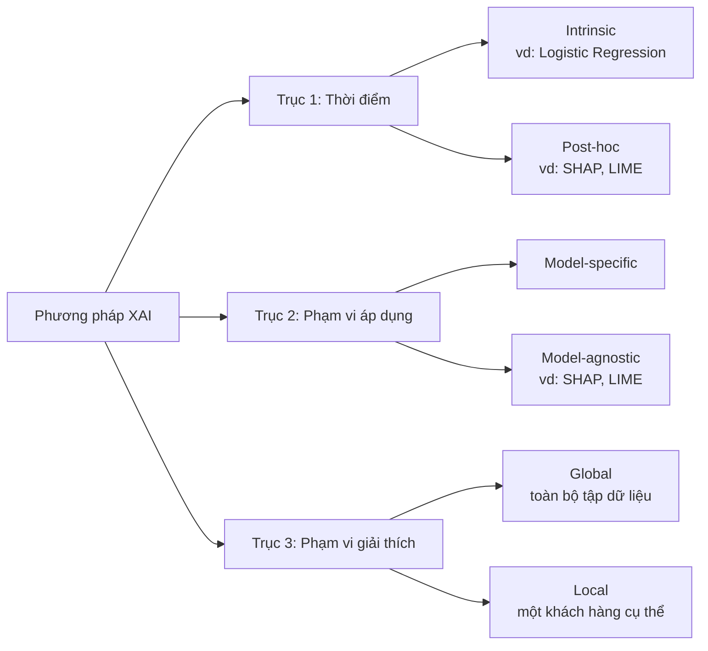

> 📚 [Mục lục](README.md) · ← [Phần 01: Machine Learning — Định nghĩa và Phân loại](phan-01-machine-learning.md) · [Phần 03: Customer Churn Prediction](phan-03-customer-churn.md) →

## Phần 2: Explainable AI (XAI) — Học máy có thể giải thích

> 🔑 **Hiểu nhanh trong 1 câu**: Không chỉ đưa ra dự đoán, mà còn giải thích được TẠI SAO mô hình dự đoán như vậy.
> 🌍 **Ví dụ đời thường**: Giống như một bác sĩ giỏi không chỉ nói "bạn bị bệnh X" mà còn giải thích "vì chỉ số huyết áp cao và bạn có triệu chứng Y" — người bệnh (ở đây là đội marketing) mới biết nên hành động cụ thể ra sao, thay vì chỉ nhận một con số xác suất mơ hồ.

### 2.1 Tại sao XAI quan trọng

Khi mô hình ML ngày càng phức tạp, chúng trở thành **"hộp đen" (black-box)** — dự đoán chính xác nhưng không ai hiểu cơ chế ra quyết định. Ví dụ cụ thể: một mô hình XGBoost dự đoán khách hàng A có 85% khả năng churn. Nếu không có XAI, đội marketing chỉ biết "85%" mà không biết **nên làm gì** — gọi điện? giảm giá? gửi email? XAI trả lời "vì Recency của A là 120 ngày (rất lâu không mua) và Frequency chỉ 1 đơn duy nhất" → từ đó biết chính xác nên nhắm vào việc kéo A quay lại mua đợt tiếp theo.

XAI ra đời để giải quyết các nhu cầu: **Tin cậy (Trust)**, **Trách nhiệm giải trình (Accountability)**, **Gỡ lỗi mô hình (Debugging)** — ví dụ phát hiện mô hình đang dựa vào cột "Customer ID" (một con số vô nghĩa) thay vì hành vi thực sự, và **Insight hành động được (Actionable insight)**.

### 2.2 Phân loại các phương pháp XAI

**Ví dụ cụ thể hoá 3 trục** với cùng một mô hình XGBoost dự đoán churn:
- **Intrinsic vs Post-hoc**: XGBoost tự nó không giải thích được — cần công cụ SHAP chạy *sau khi* huấn luyện xong (post-hoc). Ngược lại, nếu bạn dùng Logistic Regression, hệ số của biến Recency (ví dụ +0.8) tự nó đã là lời giải thích (intrinsic), không cần công cụ gì thêm.
- **Model-specific vs Model-agnostic**: `feature_importances_` có sẵn trong XGBoost chỉ dùng được cho XGBoost (model-specific). SHAP thì dùng được cho cả XGBoost, Random Forest, hay thậm chí Neural Network (model-agnostic).
- **Global vs Local**: SHAP summary plot cho biết "Recency là đặc trưng quan trọng nhất trên toàn bộ 2000 khách hàng test" (global). SHAP force plot cho một khách hàng cụ thể cho biết "khách hàng #482 bị dự đoán churn chủ yếu vì Recency=120 ngày, dù Monetary cao cũng không đủ bù lại" (local).

### 2.3 Các phương pháp XAI cụ thể (có ví dụ số)

**SHAP (SHapley Additive exPlanations)**: dựa trên Shapley value từ lý thuyết trò chơi hợp tác (Lloyd Shapley, 1953). Ví dụ đơn giản hoá: giả sử xác suất churn trung bình toàn tập dữ liệu (base value) là 0.30. Với một khách hàng cụ thể, mô hình dự đoán xác suất churn là 0.75. SHAP phân rã chênh lệch (0.75 − 0.30 = 0.45) thành đóng góp riêng của từng đặc trưng, ví dụ:

| Đặc trưng | Giá trị của khách hàng | Đóng góp SHAP |
|---|---|---|
| Recency | 120 ngày | +0.30 (đẩy xác suất churn lên) |
| Frequency | 1 đơn | +0.10 |
| Monetary | 500.000đ (cao) | −0.05 (kéo xác suất churn xuống) |
| Tổng | | +0.45 ✓ khớp với chênh lệch |

Tính chất quan trọng: tổng các đóng góp SHAP luôn khớp chính xác với chênh lệch dự đoán — đây là điểm SHAP ưu việt hơn nhiều phương pháp khác.

**LIME (Local Interpretable Model-agnostic Explanations)**: xấp xỉ mô hình phức tạp bằng một **mô hình tuyến tính đơn giản** chỉ trong vùng lân cận nhỏ quanh điểm dữ liệu đang xét, bằng cách tạo mẫu nhiễu loạn xung quanh rồi quan sát mô hình gốc phản ứng ra sao. Nhanh hơn SHAP nhưng kém ổn định hơn — chạy lại 2 lần có thể ra kết quả hơi khác nhau.

**Permutation Feature Importance**: xáo trộn ngẫu nhiên một cột (ví dụ xáo trộn toàn bộ giá trị Recency giữa các khách hàng) rồi đo AUC giảm bao nhiêu. Nếu AUC giảm mạnh (ví dụ từ 0.85 xuống 0.65) → Recency rất quan trọng. Nếu AUC gần như không đổi → đặc trưng đó gần như vô dụng.

**Partial Dependence Plot (PDP) và Individual Conditional Expectation (ICE)**: PDP vẽ đường cong "nếu Recency tăng dần từ 0 đến 200 ngày, xác suất churn trung bình thay đổi ra sao" — thường thấy dạng đường cong tăng dần rồi bão hoà.

**Counterfactual Explanations**: trả lời "cần thay đổi gì tối thiểu để đổi kết quả" — ví dụ: "nếu khách hàng này mua thêm 1 đơn trong 30 ngày tới, xác suất churn giảm từ 75% xuống 40%".

**Anchors**: tìm luật tối thiểu như "NẾU Recency > 90 ngày VÀ Frequency = 1 THÌ dự đoán churn đúng 95% trường hợp tương tự".

📎 **Tìm hiểu thêm:**
- [SHAP — Tài liệu chính thức](https://shap.readthedocs.io/)
- [SHAP — Mã nguồn & ví dụ trên GitHub](https://github.com/shap/shap)
- [LIME — Mã nguồn & giải thích trực quan trên GitHub](https://github.com/marcotcr/lime)

---

> 📚 [Mục lục](README.md) · ← [Phần 01: Machine Learning — Định nghĩa và Phân loại](phan-01-machine-learning.md) · [Phần 03: Customer Churn Prediction](phan-03-customer-churn.md) →
