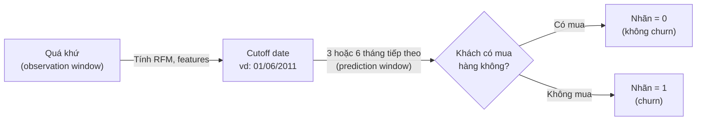

> 📚 [Mục lục](README.md) · ← [Phần 02: Explainable AI (XAI)](phan-02-explainable-ai.md) · [Phần 04: Các họ thuật toán Machine Learning](phan-04-thuat-toan-ml.md) →

## Phần 3: Customer Churn Prediction — Khái niệm học thuật

> 🔑 **Hiểu nhanh trong 1 câu**: Đoán trước khách hàng nào sắp "biến mất" để có thể giữ chân họ TRƯỚC KHI quá muộn, thay vì chỉ biết sau khi họ đã rời đi.
> 🌍 **Ví dụ đời thường**: Giống như nhận ra một người bạn dạo này nhắn tin thưa dần, ít rủ đi chơi hơn — nếu để ý sớm (Recency tăng dần), bạn còn kịp chủ động liên lạc lại; nếu đợi đến lúc họ "im lặng hẳn" mới nhận ra thì đã quá muộn để giữ mối quan hệ.

### 3.1 Định nghĩa churn (có ví dụ số)

**Churn (Customer Attrition)** là hiện tượng khách hàng chấm dứt quan hệ giao dịch với doanh nghiệp. Công thức đơn giản nhất: nếu đầu tháng có 1000 khách hàng, và 50 khách trong số đó rời bỏ trong tháng, thì **churn rate = 50/1000 = 5%**.

### 3.2 Phân loại: Contractual vs Non-contractual churn

- **Contractual churn**: có hợp đồng/thuê bao rõ ràng (viễn thông, SaaS) — ngày huỷ được ghi nhận chính xác trong hệ thống.
- **Non-contractual churn**: như e-commerce — khách hàng không "tuyên bố" rời bỏ, họ chỉ đơn giản ngừng mua. Đây là loại churn của đề tài bạn, đòi hỏi **tự định nghĩa churn bằng ngưỡng thời gian im lặng**.

### 3.3 Timeline gán nhãn churn (minh hoạ trực quan)

Ví dụ cụ thể: cutoff = 01/06/2011, churn window = 90 ngày (3 tháng) → hạn cuối là 30/08/2011. Nếu dữ liệu của bạn chỉ có đến 15/07/2011 thì **không đủ dữ liệu** để biết chắc khách có quay lại hay không trong 90 ngày đó — đây chính là vấn đề **right-censoring** cần kiểm tra trước khi gán nhãn.

### 3.4 Các cách tiếp cận mô hình hóa churn

| Cách tiếp cận | Bản chất | Câu hỏi trả lời |
|---|---|---|
| **Classification-based** | Phân loại nhị phân tại một mốc cutoff cố định | "Khách hàng X có churn trong 3 tháng tới không?" (cách tiếp cận chính của đề tài) |
| **Survival Analysis** | Mô hình hóa **thời gian đến sự kiện**, xử lý được dữ liệu **censored** | "Khách hàng X còn bao lâu nữa thì churn?" — dùng **Kaplan-Meier estimator** hoặc **Cox Proportional Hazards Model** |
| **Clustering-based** | Phân nhóm khách hàng theo hành vi (RFM + K-means) | "Khách hàng X thuộc phân khúc rủi ro nào?" |

Ví dụ trực giác về Kaplan-Meier: tưởng tượng bạn theo dõi 10 khách hàng, mỗi tháng ghi nhận có bao nhiêu người "còn sống" (chưa churn). Đường cong Kaplan-Meier vẽ tỷ lệ này giảm dần theo thời gian dạng bậc thang — nếu đường cong giảm nhanh nghĩa là khách hàng rời bỏ nhanh.

### 3.5 Customer Lifetime Value (CLV) và RFM Framework

**CLV** là giá trị (lợi nhuận) mà một khách hàng đem lại trong suốt vòng đời quan hệ. Doanh nghiệp thường ưu tiên retention cho nhóm **vừa nguy cơ churn cao, vừa CLV cao**.

**RFM Framework** — ví dụ bảng cụ thể với 3 khách hàng:

| Customer ID | Recency (ngày) | Frequency (số đơn) | Monetary (VNĐ) | Nhận định |
|---|---|---|---|---|
| A | 5 | 20 | 15.000.000 | Khách VIP, rủi ro churn thấp |
| B | 150 | 2 | 300.000 | Rủi ro churn rất cao |
| C | 30 | 8 | 5.000.000 | Khách ổn định, cần theo dõi |

📎 **Tìm hiểu thêm:**
- [Wikipedia — Churn rate (định nghĩa, công thức, ứng dụng)](https://en.wikipedia.org/wiki/Churn_rate)
- [GeeksforGeeks — Kaplan-Meier Estimator giải thích từng bước kèm code Python](https://www.geeksforgeeks.org/data-science/kaplan-meier-estimator-survival-analysis/)
- [Optimove — Hướng dẫn đầy đủ về RFM Segmentation](https://www.optimove.com/resources/learning-center/rfm-segmentation)

---

> 📚 [Mục lục](README.md) · ← [Phần 02: Explainable AI (XAI)](phan-02-explainable-ai.md) · [Phần 04: Các họ thuật toán Machine Learning](phan-04-thuat-toan-ml.md) →
