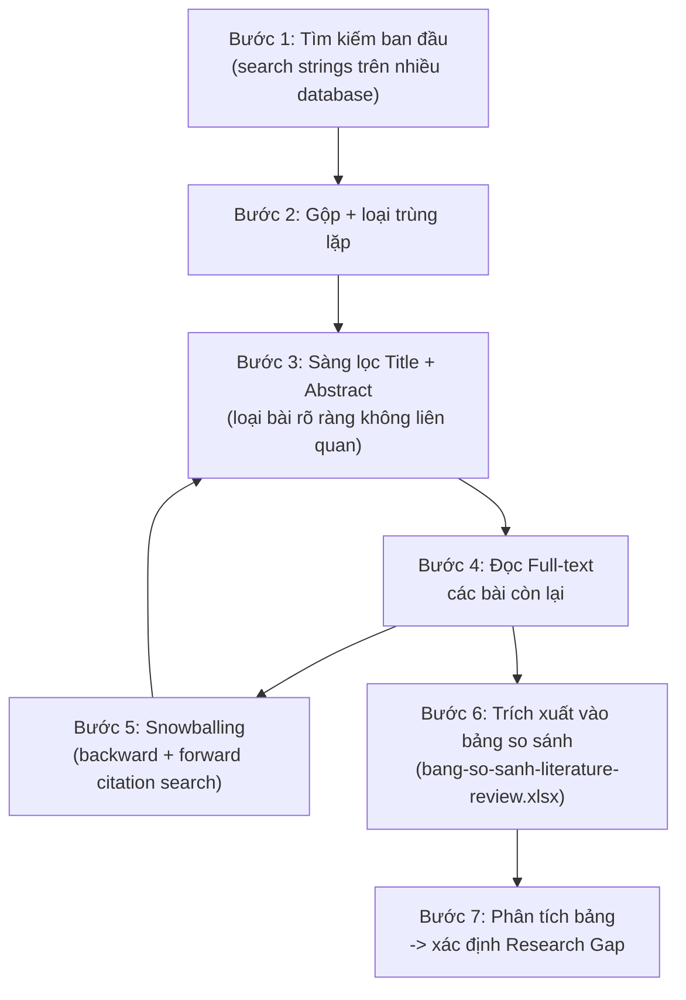

# Thiết Kế Giai Đoạn 1 — Literature Review

Mục tiêu của giai đoạn này **không phải "đọc càng nhiều bài càng tốt"** mà là xây dựng được một bảng so sánh có hệ thống (xem `bang-so-sanh-literature-review.xlsx`) để từ đó nhìn ra **research gap** thật sự — điều chưa ai làm hoặc làm chưa tốt, chính là chỗ đề tài của bạn đóng góp vào.

## 1. Quy trình tổng thể (dạng PRISMA đơn giản hóa)

Lưu ý vòng lặp giữa Bước 5 và Bước 3: khi đọc một bài full-text, bạn sẽ thấy các bài họ trích dẫn (backward) hoặc tìm xem ai trích dẫn bài đó sau này (forward) — những bài mới tìm được này lại quay về sàng lọc title/abstract như bình thường. Đây là kỹ thuật **snowballing**, thường tìm ra nhiều bài chất lượng hơn cả tìm kiếm từ khóa ban đầu.

## 2. Bước 1: Tìm kiếm ban đầu

### Nguồn tìm kiếm (databases)

| Nguồn | Phù hợp cho |
|---|---|
| Google Scholar | Tìm kiếm chung, có tính năng "Cited by" rất tốt cho forward snowballing |
| Semantic Scholar | Giao diện trực quan, gợi ý "Influential Citations" |
| IEEE Xplore | Bài về kỹ thuật/khoa học máy tính |
| ScienceDirect (Elsevier) | Bài về Expert Systems, Business/Marketing Analytics |
| arXiv | Preprint mới nhất, thường công bố trước khi qua peer review |
| Scopus / Web of Science | Nếu trường có quyền truy cập — tốt để lọc theo Q1-Q4 |

### Search strings gợi ý (đã dùng để tìm ra 6 bài trong `bai-bao-lien-quan.md`)

- `explainable machine learning customer churn e-commerce`
- `customer churn prediction online retail dataset RFM SHAP`
- `survival analysis explainable AI RFM customer churn framework retail`

Nên thử thêm các biến thể:
- `non-contractual churn prediction interpretable model`
- `SHAP LIME comparison churn prediction`
- `customer lifetime value churn prediction explainability`

## 3. Bước 2-3: Loại trùng lặp & sàng lọc Title/Abstract

### Tiêu chí đưa vào (Inclusion criteria)

- Liên quan trực tiếp đến dự đoán churn HOẶC explainability trong bối cảnh retail/e-commerce.
- Công bố trong khoảng 5-7 năm gần đây (trừ khi là bài nền tảng kinh điển về phương pháp, ví dụ bài gốc về SHAP hay RFM).
- Là bài peer-reviewed (tạp chí/hội nghị) hoặc preprint uy tín (arXiv).

### Tiêu chí loại ra (Exclusion criteria)

- Không liên quan lĩnh vực retail/e-commerce (ví dụ churn viễn thông thuần túy, trừ khi dùng để tham khảo phương pháp XAI chung).
- Chỉ là blog/tutorial không qua phản biện (có thể tham khảo cách làm nhưng không trích dẫn học thuật).
- Trùng lặp nội dung với một bài đã có trong bảng (cùng tác giả, cùng phương pháp, chỉ khác venue).

## 4. Bước 6: Trích xuất vào bảng so sánh có hệ thống

Dùng file **`bang-so-sanh-literature-review.xlsx`** đi kèm — đã tạo sẵn với đúng các cột cần thiết và điền sẵn 6 bài đã tìm được trước đó làm ví dụ mẫu:

| Cột | Vì sao cần |
|---|---|
| Tác giả, Năm, Venue, Link/DOI | Thông tin trích dẫn cơ bản |
| Bộ dữ liệu sử dụng | Biết ai đã/chưa dùng chung bộ dữ liệu với bạn (Online Retail II) |
| Định nghĩa Churn/Window | So sánh cách họ định nghĩa churn với cách bạn định nghĩa (3/6 tháng) |
| Phương pháp ML | Biết thuật toán nào đã phổ biến, thuật toán nào ít ai thử |
| Phương pháp XAI | Biết SHAP/LIME đã bão hòa hay còn hướng nào ít khai thác |
| Feature Engineering | So sánh cách họ dùng RFM hay đặc trưng khác |
| Metric đánh giá, Kết quả chính | Số liệu cụ thể để so sánh/làm baseline trong phần Results |
| Công cụ/Thư viện | Biết công cụ nào phổ biến trong lĩnh vực (thường là Python + scikit-learn/SHAP) |
| Hạn chế nêu trong bài | Chính tác giả tự thừa nhận hạn chế — đây là gợi ý trực tiếp cho gap |
| Khoảng trống liên quan đề tài | Cột quan trọng nhất — điểm bài đó CHƯA làm mà bạn có thể lấp vào |

File có sẵn dropdown ở cột "Trạng thái" (Chưa đọc / Đang đọc / Đã trích xuất / Đã viết vào Related Work) và "Người phụ trách" (A/B/C), cùng công thức tự đếm số bài đã trích xuất ở đầu sheet — tiện theo dõi tiến độ cả nhóm mà không cần đếm tay.

## 5. Bước 7: Từ bảng so sánh đến Research Gap

Sau khi điền đầy đủ khoảng 15-20 bài, đọc lại cột "Khoảng trống liên quan đề tài" của toàn bộ các dòng — thường sẽ thấy 2-3 khoảng trống lặp lại nhiều lần, đó chính là ứng viên mạnh nhất cho **đóng góp chính (contribution)** của bài báo bạn. Từ 6 bài đã tìm ban đầu, hai khoảng trống nổi bật nhất hiện tại là:

1. **Kết hợp Survival Analysis với XAI cho non-contractual churn** — rất ít bài làm đầy đủ cả 3 yếu tố (XAI + survival + RFM) trên cùng một bài toán 3/6 tháng cụ thể.
2. **So sánh tính ổn định giữa nhiều phương pháp XAI** (SHAP vs LIME vs permutation importance) trên cùng một bài toán churn — hầu hết bài chỉ dùng 1 phương pháp XAI, chưa ai so sánh có kiểm định thống kê xem chúng có nhất quán với nhau không.

## 6. Phân công đọc trong nhóm 3 người

Áp dụng nguyên tắc đã thống nhất ở `../01-tong-quan/tong-quan-de-tai.md`: Người C chủ trì tổng hợp bảng và chốt Research Gap cuối cùng, nhưng **cả 3 người cùng đọc và tự điền dòng của mình** — mỗi người ưu tiên đọc sâu các bài liên quan trực tiếp đến mảng mình sẽ làm ở các giai đoạn sau (A: dữ liệu/feature engineering, B: mô hình/XAI, C: phương pháp luận/tổng quan). Cách này giúp việc đọc literature review ngay từ đầu đã phục vụ trực tiếp cho công việc chuyên sâu sau này, không phải đọc xong rồi quên.
